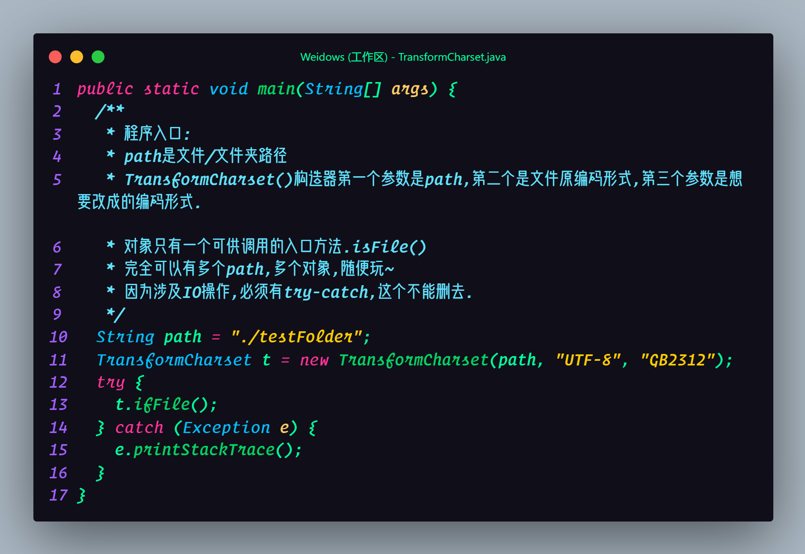
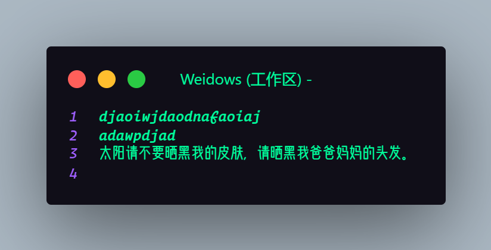
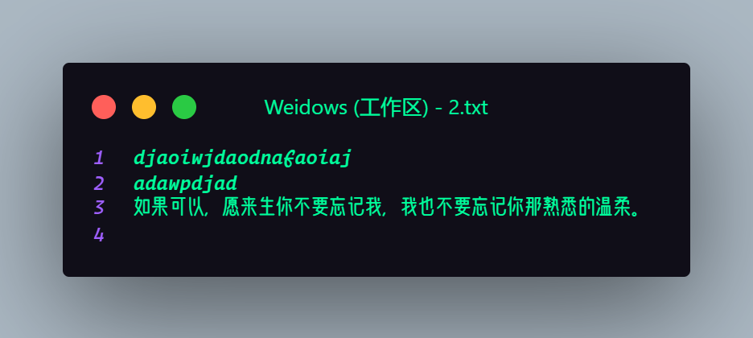
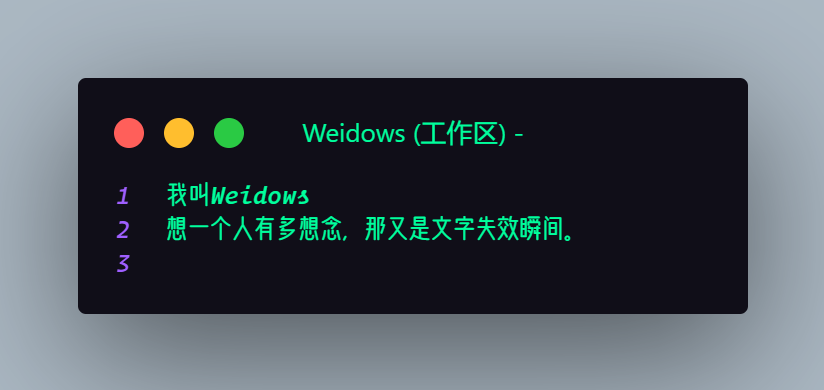
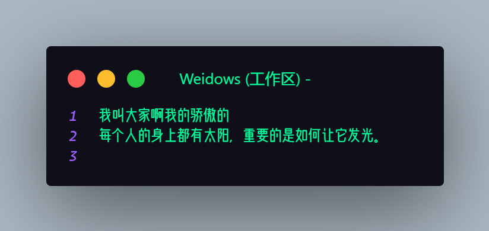
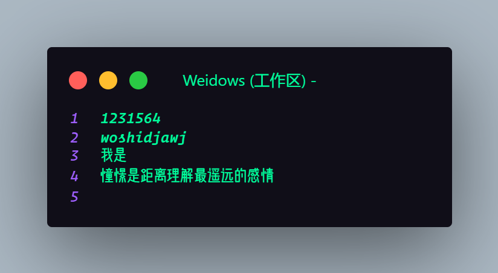

<!--
 * @?: *********************************************************************
 * @Author: Weidows
 * @Date: 2021-01-02 13:41:43
 * @LastEditors: Weidows
 * @LastEditTime: 2021-01-02 23:09:57
 * @FilePath: \Weidowsd:\Desktop\新建文件夹 (2)\README.md
 * @Description:
 * @!: *********************************************************************
-->
<h1 align="center">

🌈 文件编码格式转换器

</h1>

# 简介

> author: `计科190310刘伟`

> ID: `2019984130310`

- 用于文件字符编码格式的批量转换.

- 文章发布
  - 自制并非抄袭.
  - [CSDN](https://blog.csdn.net/qq_39823295/article/details/109409534)
  - [⭐️Weidows の Nest⭐️](https://weidows.github.io/post/Java/TransformCharset/)

---

# 原理

- 1.把文件读入并转换格式,输出到./bufferFile 这个中间文件内
- 2.把原文件删除并把中间文件回传
- Java 对象层面的操作使单一文件改写困难,而且多对象同时操作同一文件会覆写.

---

# main 代码

# 需求

把 testFolder 目录下所有文件编码格式由`UTF-8`转为`GB2312`.

---

# 执行前

---

# 执行后

- 其余的与上面相同,不再罗列.

---

# 验证

- 通过 Git 可以观察到英文字母并无变化,中文会转变格式
- 利用 VScode 与 txt 均可正常识别为 GB2312.
