<!--
 * @Author: Weidows
 * @Date: 2020-07-27 10:28:29
 * @LastEditors: Weidows
 * @LastEditTime: 2026-06-01 14:15:56
 * @FilePath: \Weidows\README.md
 * 这个markdown是显示在github-profile界面上的

STAR WHITELIST — update when adding/removing starred repos

### app
https://github.com/Weidows-projects/Crosstalk-rainbow-fart
https://github.com/Weidows-projects/Keeper
https://github.com/Weidows-projects/scoop-3rd
https://github.com/Weidows-projects/vscode-weidows-theme
https://github.com/Weidows-projects/Windows-Theme-HighContract-Tokyo-Night

### lib
https://github.com/Weidows/open-dicom-toolkit
https://github.com/Weidows/skills
https://github.com/Weidows/Rainmeter-skin
https://github.com/Weidows/wutils
https://github.com/Weidows-projects/Programming-Configuration
https://github.com/Weidows/Weidows.github.io
https://github.com/Weidows/Java
https://github.com/Weidows-projects/awesome-image-collector

### fork
https://github.com/Weidows-projects/Live2dLoader
https://github.com/Weidows/RunCat_for_windows
https://github.com/Weidows/label-studio-chinese

-->

---

  <!-- 常用语言 -->
  <!--  -->

  <!-- Website badge -->
  <!-- 

  
  
 -->

  
  <!--  -->

  <!-- 访问计数 -->
  <!--  -->
  <!--  -->
  <!-- 评级 -->
  <!--  -->

  

  <!--
  https://github.com/abhisheknaiidu/awesome-github-profile-readme
  https://github.com/DenverCoder1/DenverCoder1/blob/main/README.md
  -->
  

  ## 📌 App

  

    <a href="https://github.com/Weidows-projects/Crosstalk-rainbow-fart"></a>
    <a href="https://github.com/Weidows-projects/Keeper"></a>
    <a href="https://github.com/Weidows-projects/scoop-3rd"></a>
    <a href="https://github.com/Weidows-projects/vscode-weidows-theme"></a>
    <a href="https://github.com/Weidows-projects/Windows-Theme-HighContract-Tokyo-Night"></a>
  

  ---

  ## 📚 Lib

  

    <a href="https://github.com/Weidows/open-dicom-toolkit"></a>
    
    <a href="https://github.com/Weidows/Rainmeter-skin"></a>
    <a href="https://github.com/Weidows/wutils"></a>
    <a href="https://github.com/Weidows-projects/Programming-Configuration"></a>
    <a href="https://github.com/Weidows/Weidows.github.io"></a>
    <a href="https://github.com/Weidows/Java"></a>
    <a href="https://github.com/Weidows-projects/awesome-image-collector"></a>
  

  ---

  ## 🍴 Fork

  

    <a href="https://github.com/Weidows-projects/Live2dLoader"></a>
    <a href="https://github.com/Weidows/RunCat_for_windows"></a>
    <a href="https://github.com/Weidows/label-studio-chinese"></a>
  

  

